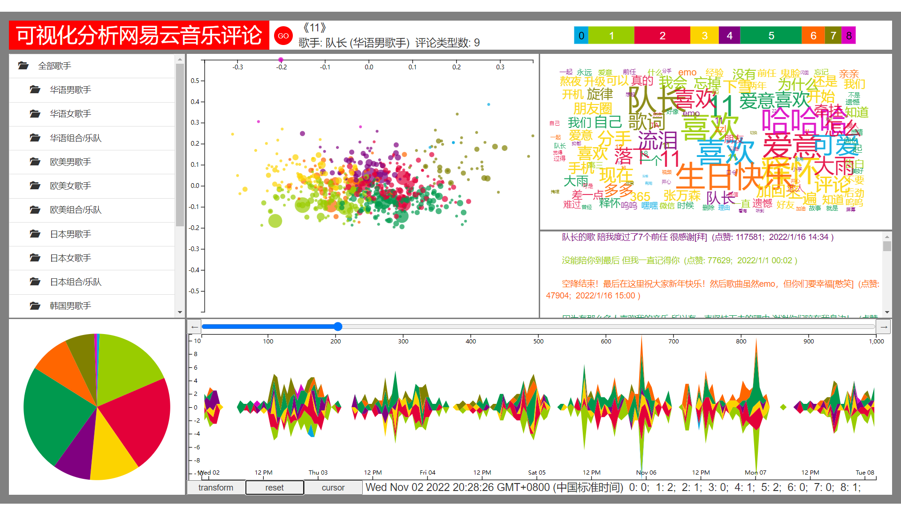
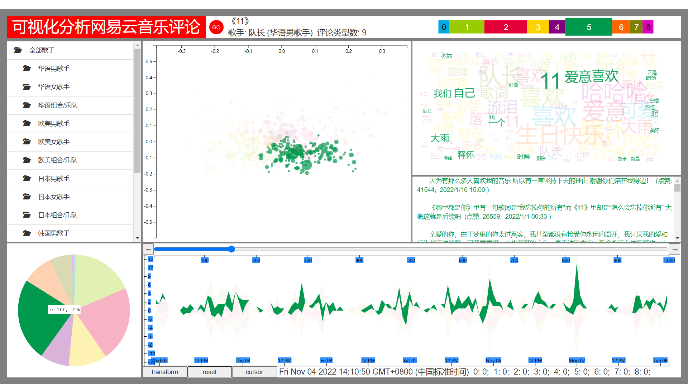
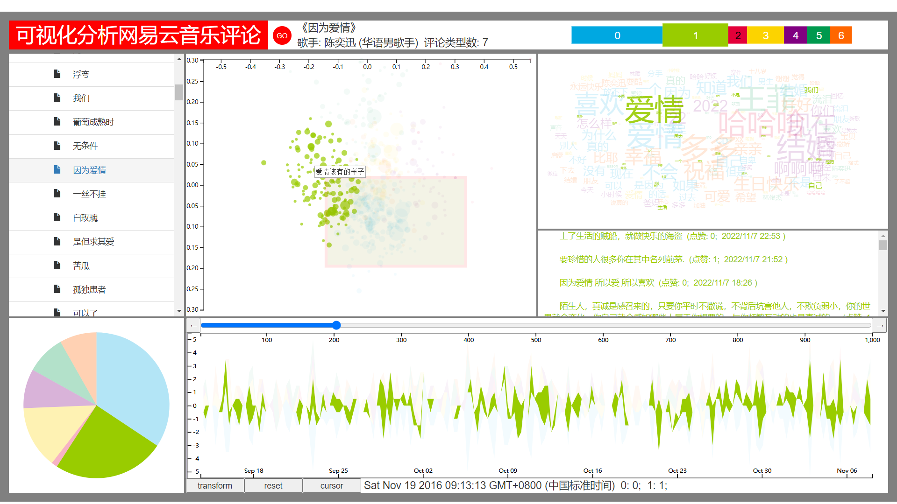
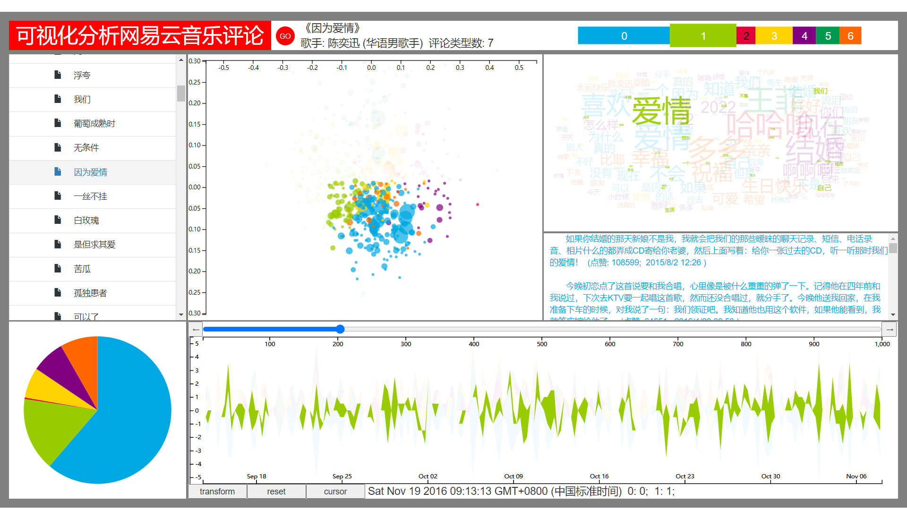
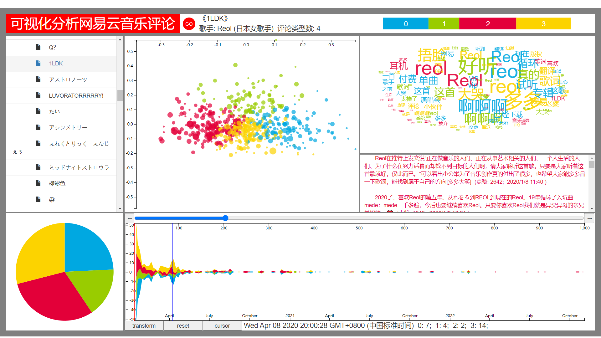
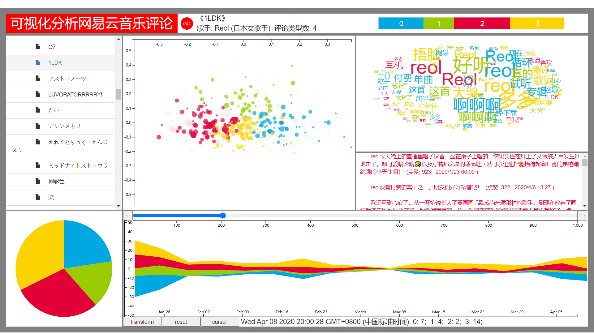
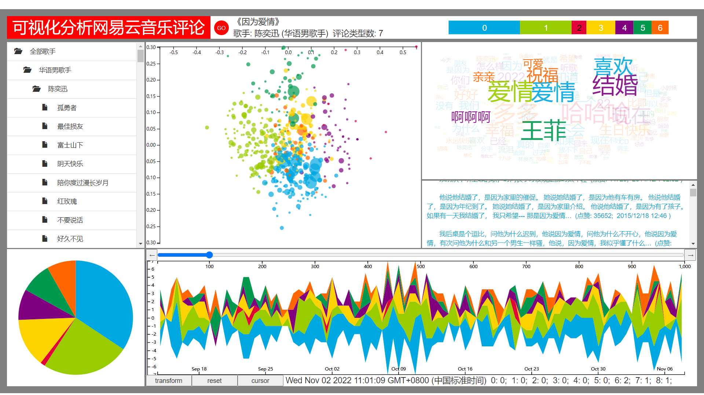

### Directory
```
|--Visual Analysis of NetEase Music Reviews
│  final.html
│  ppt_proposal.pptx
│  README.md
|      
├─data
│  │  processed_reviews.pickle
│  │  simfang.ttf
│  │  stopwords.txt
│  │  
|  ├─processed_reviews //not included intermediate files
|  |      *.pickle
|  |
│  ├─river
│  │      tr_*.json
│  │      
│  ├─songdata
│  │      *.csv
│  │      
│  ├─songid
│  │      music_info.json
│  │      singers.csv
│  │      songs.csv
│  │      song_tree.json
│  │      
│  ├─songs_comments
│  │      *.json
│  │      
│  └─tfidf
│          wc_*.json
│          
├─libs
│  ├─bootstrap-3.4.1-dist
│  │  ├─css
│  │  │      bootstrap-theme.css
│  │  │      bootstrap-theme.css.map
│  │  │      bootstrap-theme.min.css
│  │  │      bootstrap-theme.min.css.map
│  │  │      bootstrap.css
│  │  │      bootstrap.css.map
│  │  │      bootstrap.min.css
│  │  │      bootstrap.min.css.map
│  │  │      
│  │  ├─fonts
│  │  │      glyphicons-halflings-regular.eot
│  │  │      glyphicons-halflings-regular.svg
│  │  │      glyphicons-halflings-regular.ttf
│  │  │      glyphicons-halflings-regular.woff
│  │  │      glyphicons-halflings-regular.woff2
│  │  │      
│  │  └─js
│  │          bootstrap.js
│  │          bootstrap.min.js
│  │          npm.js
│  │          
│  └─js
│          bootstrap-treeview.js
│          d3.layout.cloud.js
│          echarts.min.js
│          jquery.js
│          
├─models
│      model_300_100
│      model_300_30
│      model_50_30
│      
├─process
│  ├─generate_data
│  │      h_label.py 
│  │      h_label_group.py
│  │      h_label_groupall.py
│  │      h_label_mt.py
│  │      h_process_comments.py
│  │      h_test_label.py
│  │      
│  ├─generate_themeriver_data
│  │      generate_river_data.py
│  │      generate_river_data_ori.py
│  │      h_test_themeriver.py
│  │      
│  ├─generate_wordcloud_data
│  │      h_test_wordcloud_by_label.py
│  │      h_wordcloud_final.py
│  │      
│  ├─get_general_data
│  │      generate_info.py
│  │      h_artist.py
│  │      h_song_by_artist.py
│  │      
│  ├─get_reviews
│  │      crawler_comments.py
│  │      
│  ├─preprocess
│  │      h_prepare_for_train.py
│  │      
│  ├─train_model
│  │      h_only_train.py
│  │      h_train_w2v_model.py
│  │      
│  └─utils
│          get_song_info.py
│          h_check.py
│          h_generate_tree.py
│          
└─results

```

### Crawl data
```
cd data
python crawler_comments.py
```

### Key processing files

#### h_artist.py

```
INPUT: None
OUTPUT: *singers.csv*
crawl artist info
```

#### h_song_by_artist.py

```
INPUT: *singers.csv*
OUTPUT: *songs.csv*
crawl song info by artists
```

#### crawler_comments.py
```
INPUT: *songs.csv*
OUTPUT: *song_comments/*.json*
crawl comments by songs
```

#### h_prepare_for_train.py

```
INPUT: *song_comments/*.json*
OUTPUT:  *processed_reviews*.pickles*
separate comments into words
```

#### h_only_train.py, h_train_w2v_model.py

```
INPUT: *processed_reviews*.pickles*
OUTPUT: *model_**
train word to vec model
```

#### h_label(_*).py

```
INPUT:  *song_comments/*.json*, *processed_reviews*.pickles*
OUTPUT: *songdata/*.csv*
generate dimension-reduced data with corresponding labels
```

#### h_process_comments.py

```
INPUT:  *model_**
OUTPUT: None
called by h_label.py, convert reviews to vectors
```

#### generate_river_data.py

```
INPUT:  *songdata/*.csv*
OUTPUT:  *river/tr_*.json*
generate data for themeriver
```

#### h_wordcloud_final.py

```
INPUT:  *songdata/*.csv*
OUTPUT: *tfidf/wc_*.json*
generate data for wordcloud
```

### final.html
#### Default
```
run
draw_tree
```
#### Run
```
count_label
draw_music_info
draw_legend
draw_pie
draw_scatter
draw_word_cloud
draw_comments
draw_river
```
#### Interaction
```
interaction
recover
// when selected part
interaction_scatter_comments  
recover_scatter_comments
```

### Results
#### label


#### select region


#### select period


#### worldcloud


